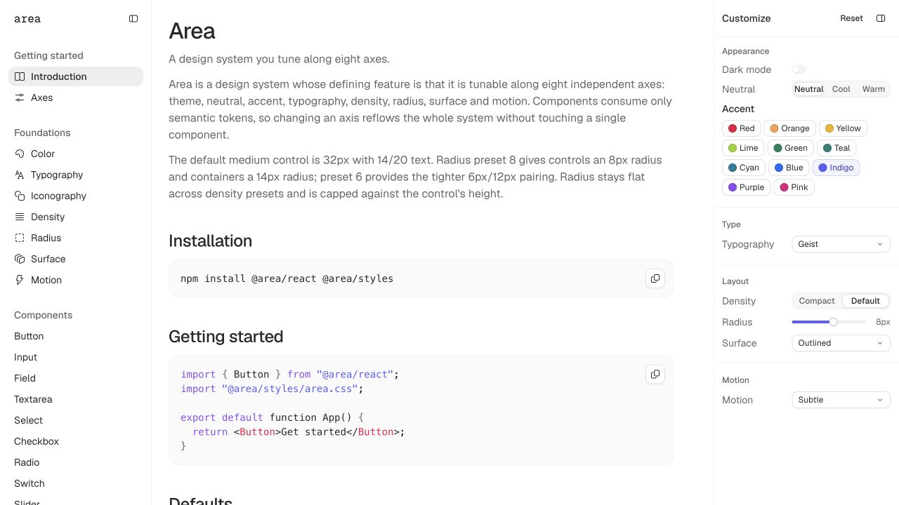
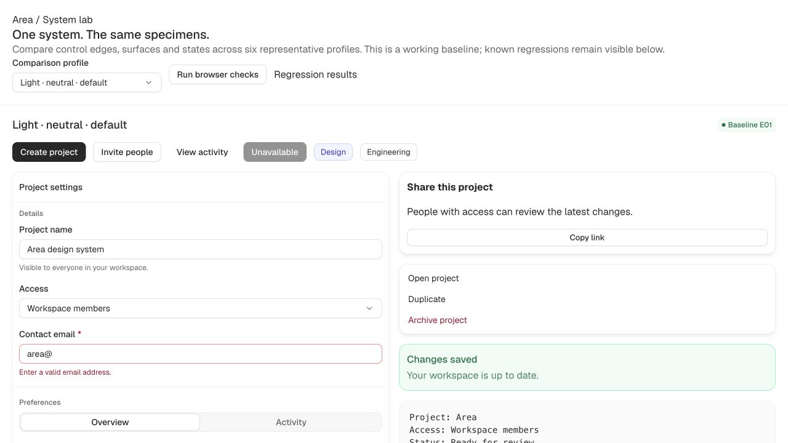
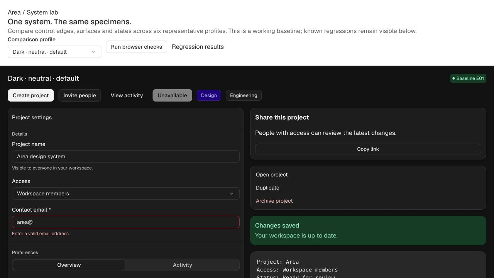
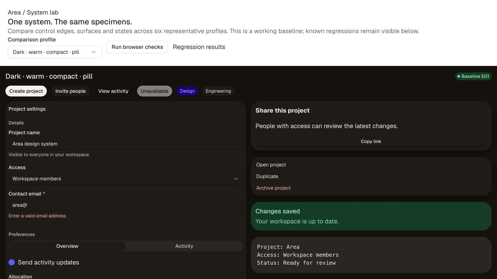

# E01 — Regression and visual baseline

**Completed:** 2026-09-14 · **Starting commit:** `e679615` · **System gate:** still red.

## What changed

- Added **System lab** to the docs navigation: one server-rendered, hydrated React fixture,
  using actual Area components, with six representative profiles and 22 browser checks.
- Added a source watcher, serialized build queue, automatic reload and immutable preview
  snapshots. Only a successful package/docs build and dogfood audit replaces the live site.
- Added four preview integration tests and a packed-package export/import probe outside
  the workspace. No package installation, publication or new dependencies were needed.
- Added a TypeScript check for the lab. Its layout CSS is included in the dogfood audit.

This is a tooling batch. Component CSS and token values did not change. The existing
75/100/150 trial remains in place, including its known contrast failures.

## Visual before / after

**Before — separate documentation pages.** The existing introduction and inspector, captured
before implementation. There was no shared comparison fixture or live rebuild workflow.

**After — the shared light comparison board.** The same specimens can now be compared on
one page. This is a new review surface, not a claim that the controls were restyled.

**Additional sample — dark, default density.**

**Additional sample — dark warm neutral, compact density, pill radius, elevated surface.**

Desktop images use a 1280 × 720 viewport. [The mobile capture](mobile.png) uses 390 × 844;
the page had no horizontal overflow at that width. Screenshots are real browser captures.
The selected viewport images intentionally show a sample; the live board includes the
remaining form controls, selected segmented control, code block and regression results.
Future visual batches must capture the same specimen, profile, viewport and state before
and after, let transitions settle, and explain changed and remaining behavior. Keep each
batch's images and a short report in a new `docs/batches/E##/` directory. For nonvisual
work, give the verification change without inventing a visual difference.

## Verified results

- Full token suite: **165 failed / 8,810 passed / 8,975 total**. Unchanged baseline.
- Contrast: **5 failing / 173 passing unwaived groups + 4 waived groups**, 66 themes.
- Docs build and audit: **39 pages, 64 catalog demos, 36/36 manifest components**. The lab
  is a separate fixture, not counted as another catalog demo.
- Typecheck: all three packages and the new lab pass. Manifest parity: 36 components pass.
- Preview tests: **4 passed** — snapshot retention/publication, serialized recovery,
  staging-path containment and content-based change detection. The tests bind an ephemeral loopback port.
- Browser: **8 passed / 14 failed / 22 checks in each of 6 profiles**. All results saved in
  [browser-baseline.json](browser-baseline.json). Scope probes are fixed light/dark fixtures;
  the four outer-height checks respond to each selected profile. These are 132 executions,
  not 132 distinct contracts or exhaustive axis coverage.
- Real keyboard slider probe: **7 passed / 15 failed** after Right advanced value 40 → 41
  while fill stayed 40. See [slider-keyboard.json](slider-keyboard.json).
- Hydration: clicking Activity updates selection; native Select changes to private access;
  Checkbox unchecks. A trusted Right key on Account still leaves focus on Account.
- Packed exports: **9 targets exist / 1 missing** (`@area/tokens` root). Raw Node imports
  fail for the token root and for the two source-only TS entry points. See
  [consumer.txt](consumer.txt). Missing peers were not installed; full compiler/React
  consumer validation belongs to E04. This check deliberately reports its failures.

### Preview failure / recovery experiment

Started `npm run dev`, appended an intentional syntax error to the owned lab source,
observed the docs build fail, then reloaded the browser. The last successful System lab
remained visible. Restored the exact source; the watcher rebuilt and published successfully.
No broken probe remains in source. Source and generated output are separated; writes inside
`dist`, `.cache` and `node_modules` do not trigger rebuilds. Content fingerprints filter
repeated filesystem notifications and unchanged writes. Restart the dev process after
changes to the watcher/server code itself.

## Reproduce

1. Run `npm run dev` and open [System lab](http://localhost:4321/lab.html).
2. Select a comparison profile and **Run browser checks**. Results show actual and expected
   values and an expandable JSON report. The harness never converts known defects into passes.
3. Refresh to reset specimen state. Focus Allocation and press Right, then rerun checks:
   `F07/slider-fill` changes from pass to fail.
4. Expand **Scope and behavior fixtures**. Focus the first Account tab and press Right:
   focus remains Account. The in-page synthetic event assertion also fails, but does not
   replace this trusted keyboard check.
5. Run `npm run test:preview`, `npm run test:consumer`, `npm test`, `npm run build:docs`, and
   `npm run typecheck`. The consumer and token commands currently exit nonzero.

## Audit coverage and next owners

- **F01 scopes:** eight computed-property assertions; E02 must replace identical-reference
  assumptions with resolver comparisons, then extend nesting, removal and mutation order.
- **F02 text/contrast:** `node docs/research/2026-09-14/measure.ts` reproduces the stricter
  normal-text diagnostics; `npm test` reproduces all current stroke failures. E03 owns fixes.
- **F03 focus:** the same measurement script compares the actual 45% composite with the
  opaque token. Keyboard focus on a Button still uses a shadow without an outline fallback.
  The lab's focus assertion proves focus movement only; it does not assert ring contrast.
  E03 must add rendered focus and forced-colors coverage.
- **F04 composites:** unique tab relationships, tab focus/arrow behavior and segmented tab
  stops have assertions. The visible Menu/Popover are presentation specimens, not complete
  interaction implementations. E05–E07 own behavior and overlay tests.
- **F05 motion:** explicit-none spinner has an assertion. OS reduced-motion precedence and
  other animation loops remain for E08, as recorded in the dated audit.
- **F06 distribution/API:** packed export and Node import command; precise manifest/prop
  mismatches remain listed in audit F06 for E04 (Button/Badge tone; Select/Slider/Panel size).
- **F07 native state:** field relationships/required state and Slider fill assertions. Audit
  F07 records additional source-level contracts to test in E06: NavItem disabled + href,
  Progress value greater than max or nonpositive max, Avatar failed image, CodeBlock trust.
- **F08 integrity:** the dated measurement script clones the registry and injects a bad
  dark property without changing production definitions; zero problems are incorrectly
  reported. Component-scoped state-selector checking remains E04/R10 work.

## Limits

The browser checks were executed in the available Chromium preview, at desktop and mobile
widths. They are in-page assertions triggered through the UI, not a headless multi-engine CI
runner. Screen-reader, forced-colors, OS reduced-motion and cross-engine coverage are not
claimed. The successful build does not imply the token gate is green. Menu and Popover
specimens intentionally retain existing library behavior; the lab adds no missing behavior
on their behalf.

**Next batch: E02 — theme resolution and scope ownership.** Preserve this evidence as E01;
record E02's changed output in its own directory.
