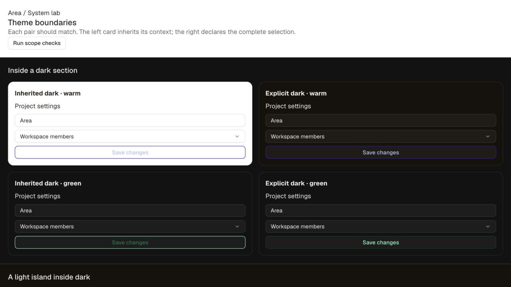
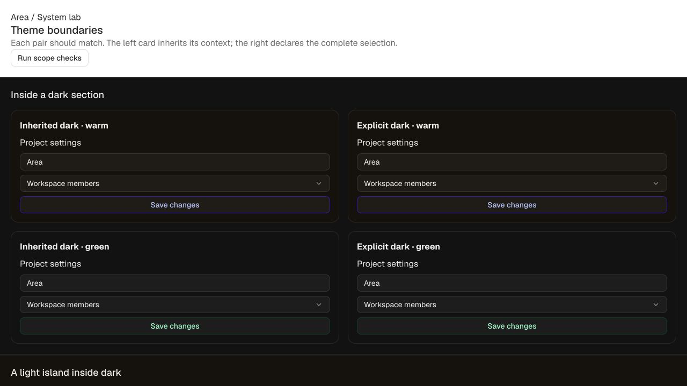

# E02 — Correct theme inheritance and scope ownership

**Starting commit:** `378f74d` · **Completed:** 2026-09-14.
**Next:** E03 — semantic strokes, normal-text contrast and focus.

## What changed

Nested CSS scopes now retain their inherited neutral and accent while switching light/dark
polarity. A neutral-only or accent-only override inside dark stays dark. Explicit light
islands reset native `color-scheme` correctly; removing attributes restores inheritance.

Color roles retain `light-dark()` pairs until consumed by real CSS color properties. Theme
no longer writes another axis's neutral/accent properties. Theme-owned colors are paired as
well, which fixes inherited shadow recipes using the wrong light/dark opacity.

The registry now validates both polarity maps and transformed emitted maps, including extra
keys, missing keys, invalid values and namespace ownership. Namespace claims cannot overlap
between axes; exact-name claims no longer behave as accidental prefixes.

Added `Theme` and `useTheme`, plus small generated configuration helpers at
`@area/tokens/config`. The React scope recreates all eight selections at a portal destination;
its defaults, types and valid presets derive from the registry. The new config entry point
imports successfully outside the workspace. Existing package-root problems remain E04 work.

See [the scope contract and integration notes](../../THEMING.md). The docs Axes page includes
a real nested React demo and its extracted source. No palette values, stroke thresholds,
component CSS recipes or contrast waivers changed in this batch.

## Visual before / after

Same fixture and **1280 × 720 viewport**. Each pair should match: inherited selection on the
left, explicit selection on the right.

**Before:** the warm child unexpectedly became white inside dark; the green outline label
used the light-theme color.

**After:** inherited warm stays dark, and the green outline label matches its explicit dark
reference. The light island further down the same page inherits warm + green correctly.

[Open the theme-boundary preview](http://localhost:4321/scopes.html). At 390 × 844 the paired
specimens remained inside the viewport without horizontal overflow.

## Measured improvement

The original before/after matrix contains **29,040 comparisons**: 66 color selections × four
scope scenarios × 109 semantic colors plus native scheme.

- Before: **25,866 passed / 3,174 failed**.
- After, same subset: **29,040 passed / 0 failed**.
- The original System lab: **16 passed / 6 failed** in every profile, up from 8 / 14.
  Its eight scope failures are resolved. Other failures remain visible.

Evidence: [before failures](before-results.json), [after summary](after-results.json),
[the six original lab profiles](lab-results.json).

## Expanded verification

**73,507 comparisons passed with zero failures in Chromium and Safari 27.0.** This is repeated
coverage of defined contracts, not 73,507 distinct features. The expanded runner checks:

- All 109 resolved semantic colors, native scheme and inherited shadow on 662 scope cases.
- All 66 theme/neutral/accent combinations across inherited selections, opposite boundaries,
  removal, layout changes, genuinely different child overrides, one-at-a-time role removal,
  three-level nesting and reversed attribute order.
- A React child and a portal mounted under the document body, outside the parent's DOM.
- All eight emitted selections and context values against independent expected fixture state,
  plus confirmation that the portal is outside the parent DOM.

Live React checks also passed after changing the parent to light and after removing the
child's red override to inherit green. Each update reran the same full matrix. The fixture
clears stale results when its selections change.

[React update evidence](react-updates.json) · [Safari accessibility-tree evidence](safari-results.txt).
Safari was driven through its native UI; Chromium through the in-app browser. The assertion
code is the same in both. Browser checks are still an in-page runner, not CI automation.
Firefox/Gecko is not installed and was not tested. No screen-reader, forced-colors or OS
preference coverage is claimed.

## Build and test results

- Token suite: **8,825 passed / 165 failed / 8,990 total**, 7 passed / 1 failed files.
  The 165 failures are the pre-existing stroke groups. Fifteen new tests cover registry,
  emitted pairs/ownership, shadow pairing and generated configuration behavior.
- Contrast report: **173 passing / 5 failing unwaived groups + 4 waived groups**, 66 themes.
- Docs build/dogfood: **40 pages, 65 demos, 36/36 manifest components**, pass.
- Typecheck: three packages and the lab, pass. Manifest parity: 36 components, pass.
- Preview regression tests: **4 passed**.
- Packed consumer: **11 export targets exist / 1 missing**. Config's compiled JavaScript
  imports successfully. The token root is still missing; raw React/manifest TS imports still
  fail in Node. The probe now checks conditional export targets too.
- Dependency lock change: React declares its new local token-package dependency. No external
  dependency was added, downloaded, installed or published for this implementation.

## Contract and compatibility decisions

The CSS path needs `light-dark()` support. Browser feature availability and primary sources
are recorded in [THEMING.md](../../THEMING.md); no legacy fallback is claimed.

The React wrapper inherits **React context**, not arbitrary DOM attributes outside its
provider tree. Supply a root Theme's host configuration explicitly when mounting React into
an existing CSS-only scope. Within the CSS-only path, independently inherited data attributes
remain fully supported. A Theme is a scope boundary, not a painted surface or overlay manager.

Raw computed custom-property strings can now contain color-pair expressions. The lab and
axis fixture measure actual consuming CSS properties instead of pretending those strings
are already-resolved hex colors. The pure semantic resolver still supplies literal colors
for contrast tests and browser reference data.

The public axis remains named `brand` until E04; the visible design concept is accent. This
batch does not add an overlapping alias. Generated config has no palette, React or DOM runtime
dependency; build tokens before typechecking or packing a fresh checkout.

## Remaining work

E03 owns the 165 stroke failures, text thresholds, syntax waivers, painted focus contrast
and forced-colors treatment. The six remaining initial lab failures concern Field help and
required state, Tab IDs and keyboard behavior, segmented tab stops, and motion-none.
The slider's fill still diverges after native keyboard input. E04 owns the remaining package
and API contract defects; later batches own component behavior and axis refinement.

Gecko execution remains an explicit release-validation item. Preserve the E01 and E02
snapshots; put the next batch's matched images and results in its own directory.
