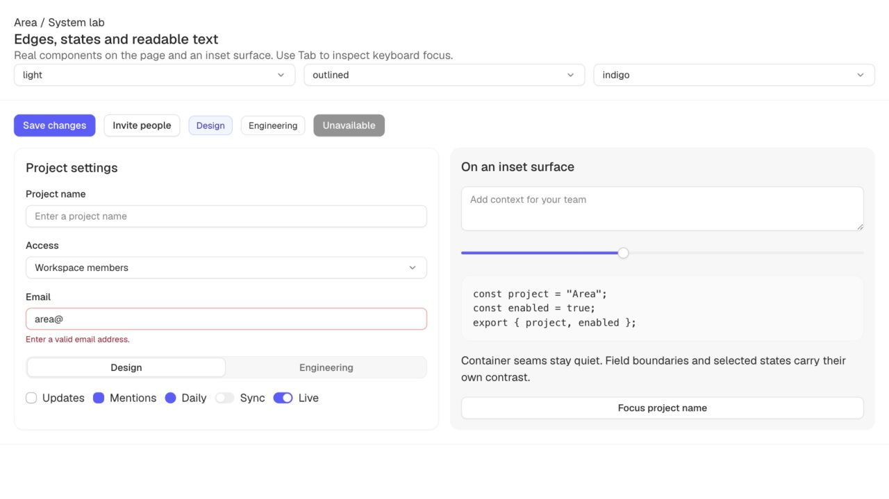
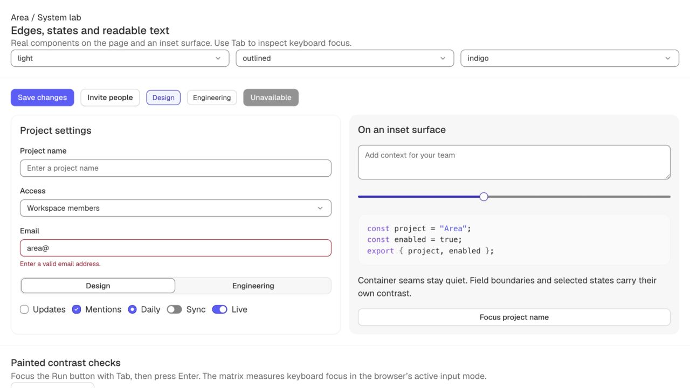
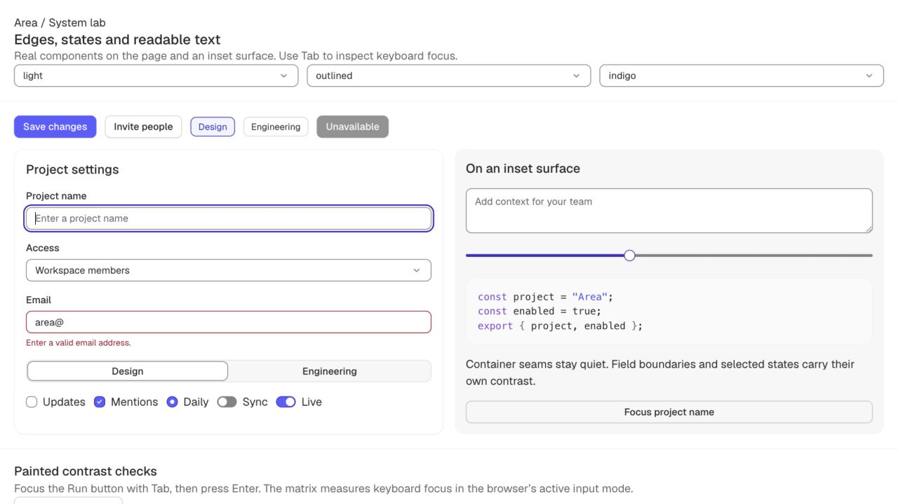

# E03 — Strokes, readable states and opaque focus

**Starting commit:** `735ddd3` · **Implemented:** 2026-09-14.
**Next:** E04 — API naming, manifest/props and compiled package contracts.

## Outcome

All **16,316 token tests pass**. The five original stroke failure groups (165 tests) are
resolved, and all four syntax waiver groups are removed through readable color selection.
The expanded report has **308 passing / 0 failing groups / 0 active waivers**, across 66
color themes. None of the existing supplementary stroke floors was lowered.

The system now distinguishes quiet framing from required control/state indicators. Editable
fields, unchecked glyphs and persistent selection keep their edges in every elevation preset.
Keyboard focus uses an opaque 2 px outline with a 2 px offset instead of a 45% halo. Placeholders,
small hover labels and syntax are tested as ordinary text. [Complete contract](../../CONTRAST.md).

## Visual before / after

Real Area components at **1280 × 720**, light/neutral/indigo, default density, radius 8 and
outlined elevation. Section and card seams remain quiet; fields and selected states now
carry a deliberate visible edge. Checkbox and radio marks are visible again.

**Before**

**After**

[Original keyboard-focus capture](before-focus.jpg). Its code column contains a capture
artifact; the field outline is the relevant comparison.

**Keyboard focus after**

[Dark before](before-dark.jpg) · [Dark after](after-dark.jpg) ·
[Open the comparison](http://localhost:4321/contrast.html).

The comparison fixture was added before token/style edits. Field geometry, profile and
viewport match. Its code specimen subsequently gained the docs' existing real highlighter;
the original code specimen was plain text. Syntax readability claims come from color tests,
not a claim that those two code screenshots depict identical syntax markup. The results
section was also added below the specimens during verification.

## Design decisions

- Preserve decorative 75. Return faint framing to 150 and quiet outlines to 200; their old
  aesthetic floors stay intact. Keep supplementary border 250 / hover 300 available.
- Add `stroke-control`450/400 and `stroke-control-hover`500/350 (light/dark) for required
  boundaries. Add `stroke-selected` from the accent's readable foreground. These solve
  distinct jobs; blanket darkening of every container was unnecessary.
- Separate constant `stroke-width` from elevation's decorative `border-width`. Elevated
  continues to soften container structure while retaining controls and selection.
- Replace `border-focus`, `ring-width`, `ring-offset` and `ring` with opaque outlines using
  `focus-color`, `focus-width`, `focus-offset`. Focus is independent of shadow recipes.
  Invalid fields retain their danger border while using the shared focus outline.
- Placeholder now shares the readable muted rung. Dark tonal text moves one step lighter
  so it clears active tinted backgrounds with the same foreground as at rest.
- A solid hover uses one adjacent rung that preserves its label. The old requirement that
  every dark hover lighten could make white labels fail; readability now decides direction.
- Syntax walks the existing palette against its actual code ground; no palette hex, hue
  rotation or chroma trim changed. The four waived syntax groups now pass without exceptions.
- Checkbox/radio pseudo-elements have positioned dimensions. The former percent-sized grid
  children could collapse to zero. Switch thumbs use the solid fill's measured foreground.
- Selected Segmented items use a real edge instead of relying on shadow. Unselected item
  foreground no longer changes on hover. Selected Chip edges persist on hover and in Elevated.
- Add system-color fallbacks for fields, choice marks, selection, invalid state and focus.
  Native Windows forced-colors execution remains pending; see limits below.

The new contract and primary standards references are in [CONTRAST.md](../../CONTRAST.md).
Historical trial and waiver rationale remain in prior batch reports and the dated audit.

## Rendered verification

**21,120 passed / 0 failed in Chromium**: 80 checks ×66 color selections ×4 elevations.
The app-owned runner measures actual CSS properties and adjacent backgrounds, including:

- Required field borders on both sides, placeholder text, invalid edges and selected Chip.
- Checkbox/radio mark dimensions and contrast; switch thumb and boundary contrast.
- Segmented selected border; solid label and real highlighted code text.
- Opaque focus color, width/style and contrast for ten representative controls per profile.
- Focus fitting the fixture's clipping ancestors. This is not a universal layout guarantee.

Run the button with **keyboard focus: Tab then Enter**. A pointer-triggered run originally
produced false failures for focus-visible; the harness now refuses that input mode explicitly.
It does not synthesize keyboard behavior or pretend a pointer focus proves keyboard styling.

[Paint summary](paint-results.json) · [worst measured pairs](paint-worst-cases.json).
The weakest measured field boundary in the fixture is the cool textarea on its inset ground,
**3.4311:1**. The actual scope runner also passes **75,493 comparisons**, preserving E02's
inheritance and portal behavior with the new semantic tokens. [Scope result](scope-results.json).

Real pointer hover samples pass in light/dark for red, green and yellow: foreground remains
unchanged, and hover label ratios are 5.628,5.995 and 12.069 respectively.
[Hover evidence](hover-results.json). Token tests cover all shipped tonal hover fills.

The original six-profile System lab remains **16 passed /6 failed** in every profile.
Those behavior failures remain visible and unchanged. [Lab results](lab-results.json).

## Verification and limits

- Token suite: **16,316 passed /0 failed**, eight files.
- Contrast: **308 passing /0 failing groups**, zero waivers. The report now exits nonzero
  if an unwaived failure appears. Package build alone still does not run the token gate.
- Build/dogfood: **41 pages /65 demos /36 of 36 manifest components**, pass.
- Typecheck: all three packages and the hydrated lab, pass. Manifest parity:36 components.
- Preview tests: **4 passed**. No new external dependency was added.
- Packed consumer retains the E02 result: config imports; token root is missing and raw
  React/manifest TS imports fail in Node. These are E04 work, not hidden by the green token suite.
- Chromium is the browser validated for E03. Safari could not be rechecked because the host
  Mac was locked; E02's earlier Safari result does not establish E03 coverage.
- Firefox/Gecko, native Windows forced-colors and assistive-technology execution remain
  release-validation items. Fallback rules are implemented, but no native forced-colors
  pass is claimed. The existing keyboard slider fill bug remains later behavior work.
- The native Select chevron retains its existing fixed SVG in normal color mode; required
  field definition is now token-driven, and forced colors restore its native arrow. A
  fully themeable arrow is a remaining component refinement, not a contrast pass inferred
  from this paint runner (which measures Select's border and focus).

Preserved logs: [original failures](before-contrast.txt), [final contrast](after-contrast.txt).
At 390 × 844 the comparison has no horizontal overflow. Full local logs use `/tmp/area-e03-*.log`. Current plan, conventions, architecture, maintenance,
journal and handoff are updated. E04 is next; native validation limits remain explicit.
