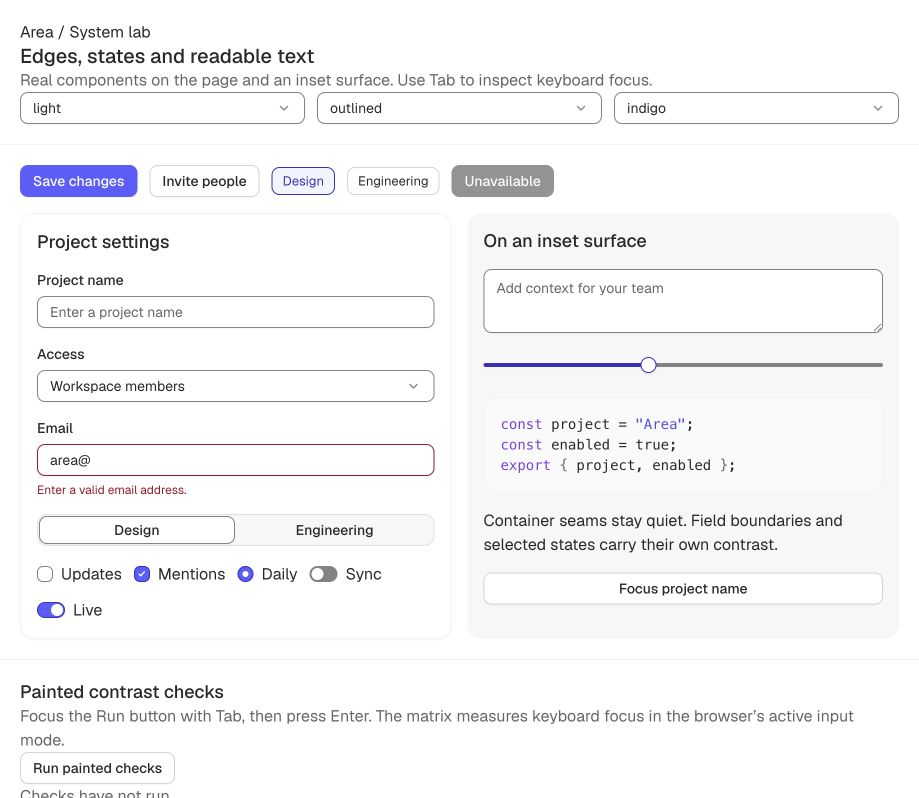

# E04 — One vocabulary and usable package contracts

2026-09-14 · baseline `8c6c067` · local implementation, no publication.

## Outcome

Area's public axis and chromatic tone are `accent`; the neutral tone is `neutral`.
Token values and the E03 stroke/contrast policy are unchanged. The docs migrate old saved
accent preferences once and keep other valid selections. [Full migration guide](../../API_MIGRATION.md).

Literal manifests now supply strict variant/size types. Invalid helper values and keys are
errors. The CSS audit checks exact component classes, sub-elements and modifiers; native,
ARIA and data states belong to the component, and negated or neighboring states cannot
satisfy a missing state. Table-cell modifiers are declared and their base cell slot is real.

Select, Slider and Chip expose their existing large tiers; Panel exposes xs. Nav's accent
prop now reaches its actual CSS. Menu exposes existing layout/selection options. CodeBlock
no longer emits nonexistent toolbar/title classes; its actions use the existing slot.
The edited native form family moved out of the large primitives file without behavior changes.

Packages ship compiled ESM and declarations with explicit public exports. The token root is
now the lightweight configuration API. CSS stays separate and survives bundling. React is a
required peer; React DOM is supplied by applications, and build-only color/style dependencies
no longer appear as runtime dependencies. No dependency version was added or upgraded.
Theme's client directive is preserved per module; the whole library is not marked client-only.

## One-off visual comparison

The following are independent browser captures taken before and after this batch, at the
same natural **919 × 798** viewport, light/neutral/indigo/outlined profile, no focused control,
and slider value 41. They are **byte-identical**, confirming that the contract and package
cleanup did not alter this specimen's geometry, strokes or colors. This is preservation
proof for the pictured state, not a claim that all pages are pixel-identical. Nav's accent
variant and the named component API corrections above are intentional fixes elsewhere.

### Before

### After

Both SHA-256: `d96d9b53bd6290cc98ecd02bf5ff92a804b82f35a0705ec5101714c39bc4bf0e`.
The existing keyboard-slider fill defect is visible in neither static image as a new change;
this batch preserves it and records it for later behavior work.

## Verification

- Token suite: **16,316 passed**, eight files; **308 passing contrast groups**, zero failures
  and zero active waivers across 66 themes.
- Build and docs: **41 pages /65 demos /36 components**; manifest parity and dogfood pass.
- Typecheck includes all docs demos as well as the hydrated lab and three packages.
- Contract tests: **12 passed**, covering scoped native states, negation, class-prefix
  collisions, missing/undeclared selectors, duplicate values and preference migration.
- Preview server regressions: **4 passed**.
- Isolated local tarballs: all **24 concrete export-condition targets** exist. Strict NodeNext
  declarations pass, including expected errors for unsupported component sizes, retired
  naming, misspelled helpers and removed CodeBlock title. Runtime rejects invalid values.
- Node SSR renders representative controls and nested inherited themes without DOM globals.
  Browser bundling produces JS plus CSS; unused components and manifests are removed.
  Minified helper-only bundle: **1,417 bytes**. Button with React external: **2,236 bytes**.
  These are fixture sizes, not a universal application-size claim.
- Chromium paint matrix: **21,120 passed /0 failed**. Scope matrix: **75,493 passed /0 failed**.
- Original six-profile behavior lab: **16 passed /6 failed /22 checks** in every profile,
  unchanged from E03. [Behavior evidence](lab-results.json), [paint summary](paint-results.json),
  [scope summary](scope-results.json), [packed consumer](consumer.txt).

## Remaining work

E05 proves the composite interaction architecture with Tabs and Dialog before broader adoption.
Existing Field relationships/required semantics, Tab IDs/keyboard behavior, Segmented tab
stops, motion-none animation and slider keyboard fill remain open. This batch does not claim
accessibility completion.

Node SSR and a browser bundle are verified. RSC framework integration, React 18 peer coverage,
Gecko, current Safari validation and native Windows forced-colors remain release checks.
The isolated consumer copies installed tools/peers rather than testing a registry install.
No package was published and no remote push was attempted.
