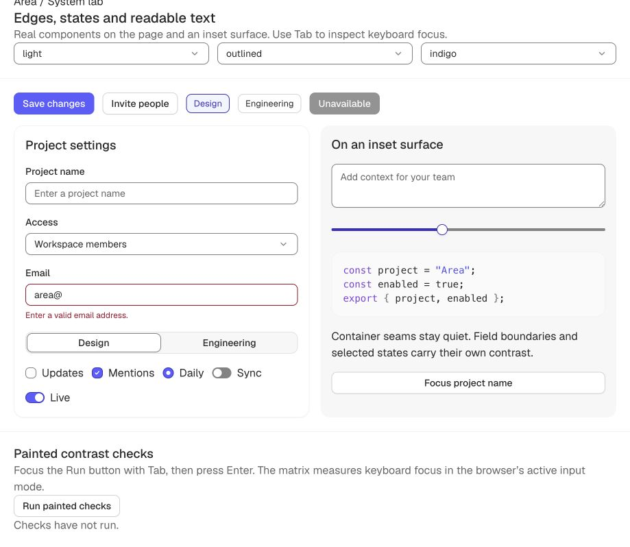
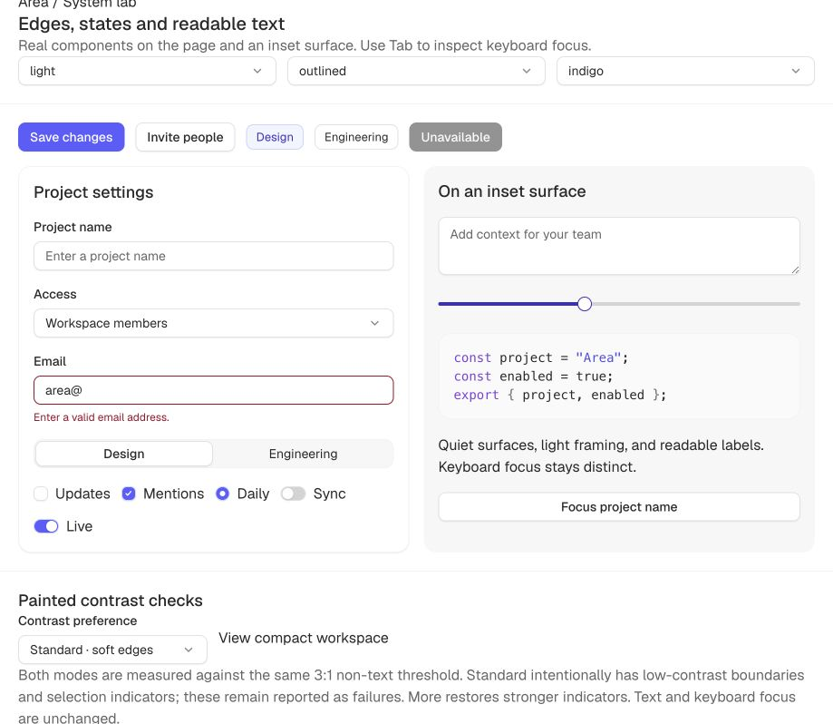
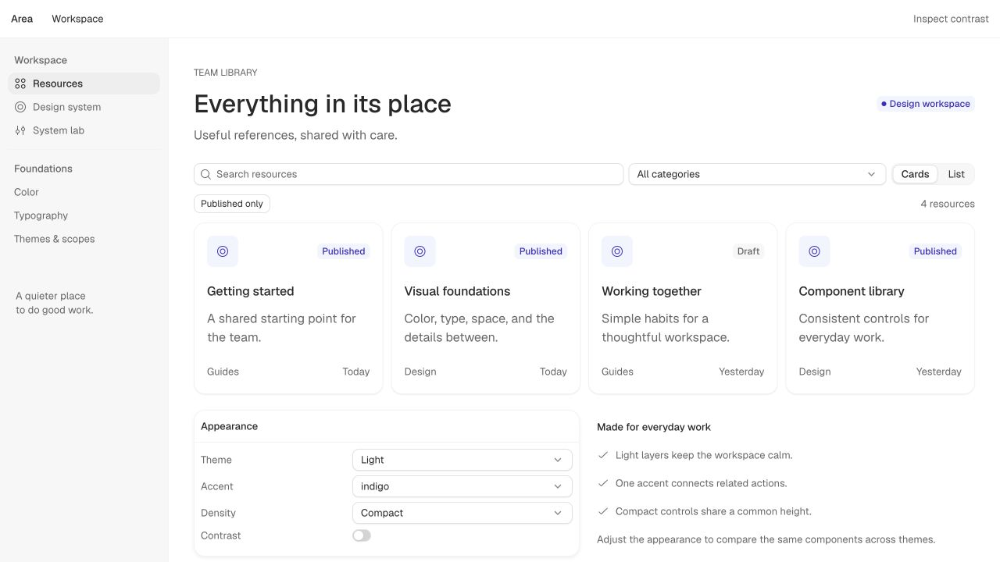

# V01 — Quiet surfaces and consistent controls

**2026-09-14.** Visual calibration inserted after E04 and before E05. The user rejected
E03's heavy default outlines and supplied seven visual references. This batch implements
the revised direction across shared tokens and components. The complete system is still
not release-ready; interaction and cross-engine work remain.

## Reference study

The seven supplied images establish a consistent hierarchy. These are visual observations,
not claims about the source products' exact tokens or measured screenshot colors.
The user-supplied originals are preserved locally: [1](references/01.png), [2](references/02.png),
[3](references/03.png), [4](references/04.png), [5](references/05.png), [6](references/06.png),
[7](references/07.png).

1. **Alpaca workspace:** white content and rail, almost invisible section seams, a pale
   selected navigation row, one dark call to action. The benefits list reads as one container,
   not three boxed cards. Adopt quiet grouping and sparse emphasis.
2. **Audit log:** white filter controls with light outlines; the table header is only a small
   step from the rows. Repeated rules are quiet enough to scan past. Adopt shared control
   edges and density-aware table padding.
3. **Store settings:** a faint neutral sidebar gives white content a boundary without a dark
   frame. Navigation relies on alignment and grouping. Adopt a single subtle background step.
4. **Dovetail:** compact navigation and restrained active rows surround a denser data grid.
   Its grid is stronger than its app chrome. Preserve role-specific hierarchy rather than
   applying the same stroke everywhere.
5. **Interface picker:** barely raised cards and a small white segmented selection; one
   selected card has a deliberately strong black outline. Softness does not mean removing
   every strong state. Keep meaningful emphasis and a stronger contrast preference.
6. **Resource library:** near-white cards, pale input frames, short metadata, one dark action.
   The small shadow helps edges separate without a thick stroke. Adopt a 1px contact shadow.
7. **Conversation/activity:** alternating near-white layers, a faint timeline, and a sparse
   blue completion signal. Adopt accent restraint: light fills for grouping, vivid color
   only where it conveys a state or action.

### Primary references checked

- [OpenAI Apps SDK UI semantic tokens](https://raw.githubusercontent.com/openai/apps-sdk-ui/main/src/styles/variables-semantic.css)
  separate soft, surface, outline, solid and ring roles. Primary surface borders use 5%/8%
  alpha, while outlined controls use stronger 16%/25% alpha. This supports separating jobs;
  it does not imply every ChatGPT edge is 5%. This is OpenAI's public Apps SDK UI library,
  not access to the private ChatGPT application's stylesheet.
- [shadcn theming](https://ui.shadcn.com/docs/theming) separates border, input and ring
  variables. Its [Input source](https://raw.githubusercontent.com/shadcn-ui/ui/main/apps/v4/registry/new-york-v4/ui/input.tsx)
  combines a quiet border with a small shadow and a separate focus treatment. Area keeps
  its own 32px/28px density contract instead of copying shadcn's control height.
- [Notion sidebar guidance](https://www.notion.com/help/navigate-with-the-sidebar) documents
  grouped, collapsible navigation; [page customization](https://www.notion.com/help/customize-and-style-your-content)
  exposes small text and full width separately. The useful principle is that interface
  density and reading layout are independent. No exact Notion color or pixel measurement
  is inferred from those help pages.
- [WCAG non-text contrast](https://www.w3.org/WAI/WCAG22/Understanding/non-text-contrast.html)
  distinguishes information needed to identify a control/state from supplementary decoration.
  A text label does not universally exempt an empty input boundary or selected state.

## Implemented decisions

### Palette and hierarchy

The palette export, hue rotations, chroma trims, scale generation, semantic color inversion,
text colors and solid fills are unchanged. This is a change in how existing colors are used.
Light page/surface white and the subtle neutral-50 layer remain the basis of the composition.
Container/table seams remain neutral 75. Resting control presentation now uses neutral 150
through `border-faint`, with neutral 200 through `border-subtle` on hover. These values refer
to light neutral; warm/cool and dark continue to resolve their own existing tokens.

The earlier 75/100/150 trial is not reinstated as a universal three-step scale. A seam and
an empty field have different roles; 150 is the quiet control endpoint, and 200 preserves a
small hover step. No new palette rung or color was fabricated.

### Presentation aliases and contrast preference

Six derived aliases connect the presentation to established colors:

- `edge-control`: faint framing → strong control stroke.
- `edge-control-hover`: subtle framing → strong hover stroke.
- `edge-selected`: faint framing → strong neutral selection stroke.
- `edge-accent`: existing per-family quiet accent edge → strong accent selection stroke.
- `fill-toggle`: subtle neutral fill → strong control fill for an unchecked switch/track.
- `fill-toggle-hover`: one stronger neutral fill → strong control hover fill.

The arrows describe standard → increased contrast, not animation. A unitless
`contrast-more` flag selects the exact endpoint using CSS color mixing at 0% or 100%.
Aliases are unregistered and re-emitted at all eight axis boundaries and contrast boundaries.
This keeps nested themes and explicit subtree overrides correct.

`data-area-contrast="standard"` requests soft framing; `data-area-contrast="more"` requests
stronger indicators. Unconfigured roots respect `prefers-contrast: more`. An explicit
standard subtree can reset an inherited more preference. Contrast is an accessibility
preference outside the eight creative axes, not a ninth color axis or a palette mutation.

### Components and elevation

- Input, Textarea and Select share the quiet resting/hover edge aliases. Invalid edges and
  opaque keyboard focus stay distinct.
- Neutral outline Button and unselected Chip use the same control framing. Tonal outlines
  retain the existing per-family measured colors.
- Segmented tracks use decorative seams. Selection is a white/surface plate, faint edge,
  contact shadow and 500 weight; unselected labels use 400. Height and concentric corners
  retain the existing tier contract.
- Selected Chips and checked choices use the quiet accent edge. Checkbox/radio marks and
  switch thumbs retain the measured solid foreground; the unchecked switch track is pale.
- Slider tracks share the quieter neutral fill; thumb shadows step down to the contact tier.
  The active track and thumb outline retain a stronger accent signal.
- Shared shadow ink is black at **6% in light / 8% in dark**. The default outlined contact
  shadow is **0 1px 1px 0**. Higher tiers keep a graduated spread for floating content;
  flat remains shadowless. Panel steps down from shadow-3 to shadow-2. User text “blue: 1”
  was interpreted as “blur: 1” for the contact shadow.
- Navigation labels remain stable on hover; only the backplate changes.
- Table padding now follows `gutter-sm` / `gutter-md`: 10/12px default, 8/10px compact.
  Density documentation now correctly states that interface type steps down with the box.

### Whole-system specimen

[Quiet workspace](http://localhost:4321/workbench.html) composes the public Area components:
Nav, cards, table, search Input, native Select filters, Segmented view control, Chip filter,
Panel, Field, Switch and Badge. It demonstrates a neutral rail, white content, consistent
compact controls and sparse accent tints. Search, category, published filtering, empty-state
reset, card/list view, theme, accent, density and contrast all work locally.

No second CSS skin targets Area components. Layout uses system tokens and existing documented
site-width values. The preview's dogfood audit was fixed to read component coverage from the
same staged output as its other checks; it previously read old dist when a new page appeared.

## Validation and limitations

- Token suite: **16,318 passes** in eight files; **308 passing contrast groups / 0 failures / 0 token waivers** across 66 themes.
- Docs build: **42 pages / 65 demos / 36 components**; parity and dogfood pass. Page counting now reads the actual lab page count.
- Package/docs typechecking, 12 contract tests, 4 preview tests and the isolated packed consumer pass. Consumer validates 24 export-condition targets, SSR, browser JS/CSS and tree-shaking.
- Browser scopes: **75,493 passes / 0 failures**. The independent shadow reference was updated from the old 10%/45%, 2px-blur recipe after confirming all 662 initial shortfalls were stale shadow expectations.
- Preference resolution: **288 passes / 0 failures**, six aliases through eight axis boundaries, both inherited and explicitly reset modes.
- Workspace: working filters/empty state, both views, theme/accent/preference changes; toolbar heights 28/28/28px compact and 32/32/32px default. At 390px the document also measures 390px, with no page overflow. Temporary viewport override reset.
- Behavior lab: all six profiles remain **16 passes / 6 failures / 22 checks**. No original behavior defect is marked fixed.
- [Palette preservation hashes](palette-preservation.json) prove palette.json, curves.ts, scale.ts and semantic aliases unchanged from 5f0f749.

See the adjacent JSON summaries and verification files for measured results. Both visual
modes use the **same** non-text 3:1 checks. Standard has 17,424 passes / 3,696 shortfalls;
More has 21,120 passes / 0 failures, across 66 themes × 4 surfaces. Text, invalid edges,
mark geometry and keyboard focus continue to pass. Some audited borders duplicate an
otherwise visible fill/label; the shortfall count is not a one-to-one WCAG violation count.
It does establish that standard is not a universal 3:1 indicator treatment. No thresholds
were lowered and no accessibility pass is claimed for the soft appearance.

The token gate still checks the strong indicator endpoints. It cannot prove which alias a
consumer paints; the browser matrix supplies that evidence. Explicit preference inheritance
is checked separately from accessibility. Native OS increased contrast, Windows forced
colors, current Safari and Gecko still require platform execution. Do not infer overall
conformance from the increased-contrast fixture's pass.

The native Select popup remains platform-owned. Its fixed SVG chevron still needs a
separate theme-aware refinement. A searchable Combobox does not exist yet; E12 owns it after
selection/overlay behavior is established. Six original behavior failures per profile and
the slider keyboard-fill synchronization defect are not fixed by visual styling.

## What to pursue next

1. **E05–E07 interaction foundations:** Tabs/Dialog architecture, Field help/required wiring,
   Segmented keyboard behavior, slider paint/value synchronization and reduced motion.
2. **E08 typography and density:** extend density-aware spacing to remaining chrome after
   measurement; inspect long labels, localization, zoom and narrow inspectors. Content type
   remains independent. Avoid globally shrinking prose to imitate compact chrome.
3. **E09 visual consistency:** theme-aware Select chevron; complete Menu/Popover/Dialog state
   compositions; verify subdued surfaces and hover/selected states at every radius/density.
   Raised/elevated remain optional; outlined is the quiet baseline.
4. **E10 release checks:** Safari, Gecko, native forced colors, OS contrast preference,
   assistive technology and package/framework support. Reassess default soft state cues in
   complete workflows; stronger mode alone is not a substitute for this review.
5. **E11 customization:** preference persistence, product-level theme recipes combining
   existing axes, coherent surface recipes and controlled semantic overrides. Keep palette
   editing outside scope until the user explicitly approves it.
6. **E12 expansion:** searchable Combobox, command/menu flows and other missing composites
   built on the validated behavior architecture, not independent styling/interaction models.

## Visual evidence

These are actual browser captures. Light/dark controls have matched before/after viewports;
the new workspace has no prior equivalent and is shown as a new composition.

### Before · controls

### After · controls

### New · compact workspace

Dark samples: [before](before-dark.jpg), [after](after-dark.jpg),
[workspace](workspace-dark.jpg). See also [list view](workspace-list.jpg) and [narrow layout](workspace-mobile.jpg).
