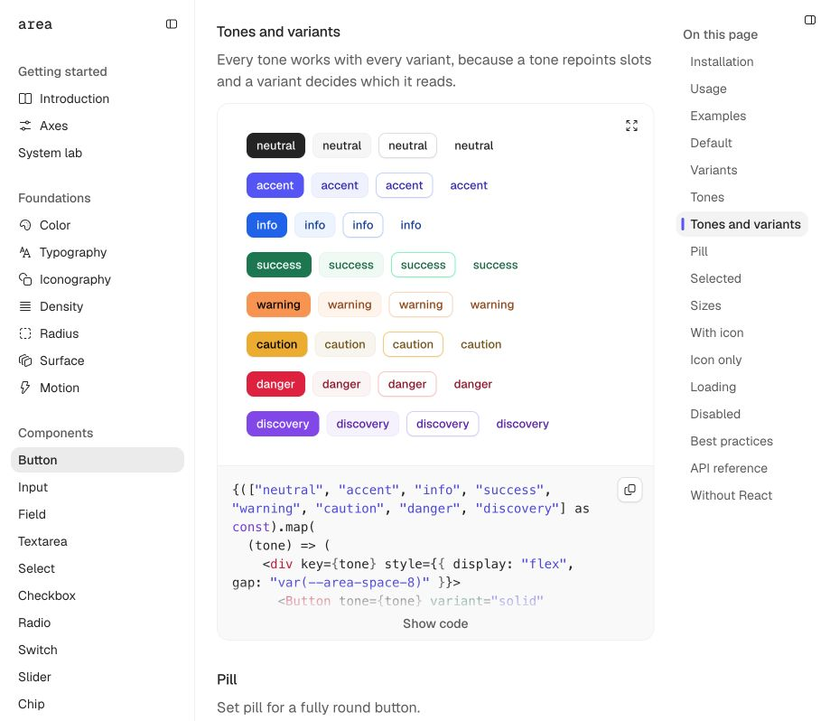
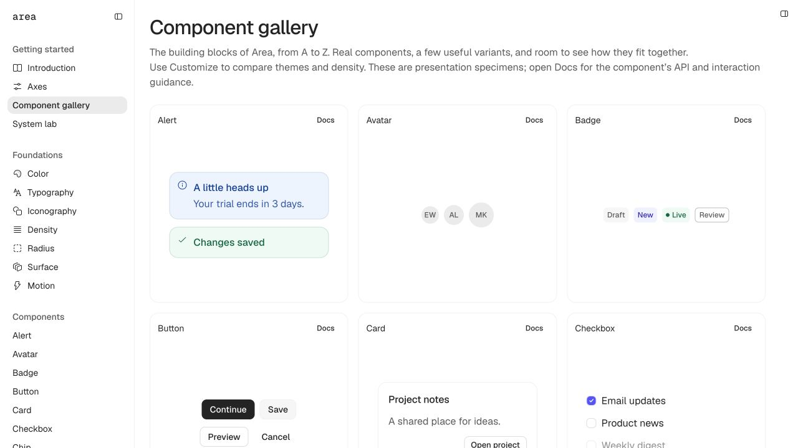
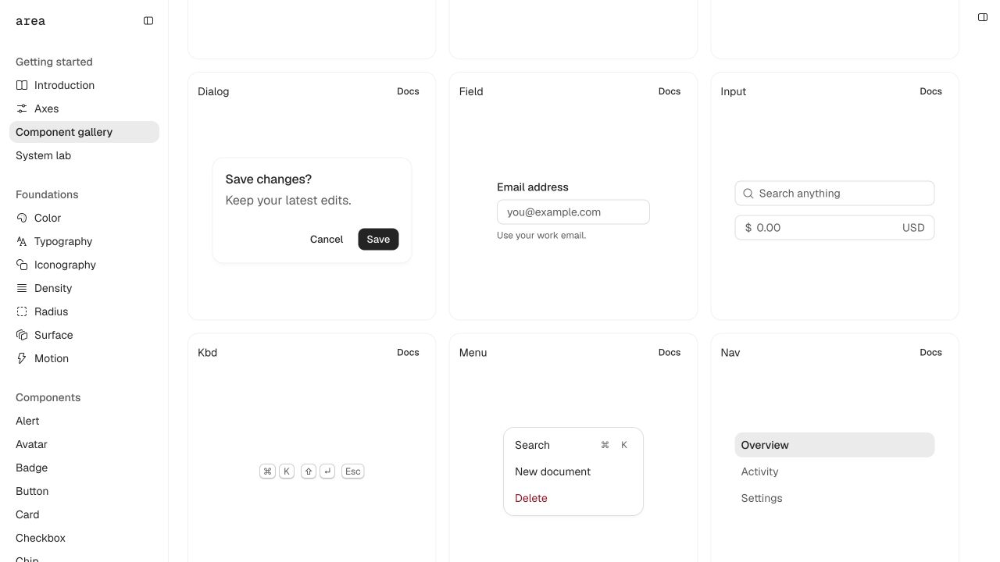

# V02 — Tonal harmony, contact shadows and component gallery

Implemented 2026-09-14, from `cd657a1`. This finishes the requested visual/gallery batch;
Area’s interaction and release work remains open. Next: E05 in the [execution plan](../../IMPLEMENTATION_PLAN.md).

## What changed

### Green and tonal strokes

The conspicuous success outline was a highly saturated raw green rung. Equal luminance
contrast did not produce equal visual weight across hues. The semantic resolver now tints
each family’s existing readable ink over the canonical neutral surface, selecting the
first quantized opacity that satisfies the unchanged stroke contrast policy. This applies
to every chromatic tone and accent in light/dark, including hover; no one-off green override.

- Green rest: `#82f7c4` → `#d0e5dd`; OKLCH chroma 0.1296 → 0.0248.
- Green hover: `#00c787` → `#97c5b5`.
- Rest contrast stays above 1.3; hover above 1.9, with the existing dark APCA requirement.
- All eleven families are bounded by new chroma-budget tests, including cross-family spread.
- Fill and foreground selections are unchanged. Palette export, hue rotations and chroma
  trims are byte-identical to the starting commit: [SHA-256 evidence](palette-preservation.json).
- The new tints are semantic colors, not new numbered palette rungs. `aliasLevel()` correctly
  returns null for these computed strokes. The canonical ground keeps axes independent.

[All 44 before/after stroke measurements](tonal-strokes.json) · [Actual rendered success variants](rendered-success.json).

### Shadows

Shared ink changes from 6% to **4% black in light**, 8% to **6% in dark**. Outlined contact
shadow becomes **0 offset horizontally, 0.5px down, 1px blur, −0.5px spread**. Higher surface
presets use similarly restrained negative spread and short blur/offset: the largest elevated
shadow is now 5px down /12px blur /−3px spread, previously 24px down /48px blur.

Solid, soft and outline buttons share shadow-1; ghost remains a flat text action. Flat
surface removes all drop shadows. Inputs, selects, segmented selections, choice marks,
slider thumbs, cards, panels and floating surfaces inherit the same revised elevation
recipes. Inset rings and shape-defining rules continue to be borders, not elevation effects.

### Alphabetical gallery and docs

Open [the gallery](http://localhost:4321/gallery.html). It contains **32 component families**
in alphabetical order, each in a square tile with its name upper left and Docs link upper
right. Components keep native token sizes with generous padding. Useful variants appear
inside a tile; comprehensive matrices remain on each API page. All **36 manifest blocks**
are represented, including compound pieces within their parent specimens.

The sidebar uses the same alphabetical metadata. Code, Code block and Segmented now have
dedicated documentation pages. A missing gallery specimen fails the docs build. All demos
are real public React components rendered by the existing source/preview pipeline.
[Gallery implementation notes](GALLERY.md) explain coverage and presentation-only behavior.

Narrow-screen review exposed an existing cascade error: rail `display:none` in the base
layer lost to Panel’s component display. Responsive rails now open above content, one at a
time on mobile, and close back to their corner controls. Focus and desktop preferences are
preserved; content is no longer covered by sidebar text.

## Visual summary

Real browser captures, not generated mockups. Button captures use the same 919×798 viewport,
light/default settings and tones section. The final responsive fix also removes the crowded
outline column at this width; the button matrix itself remains at the same origin.

### Before

### After

### New gallery

[Mobile capture](gallery-mobile.jpg) · [Dark compact capture](gallery-dark-compact.jpg) · [Supplied gallery reference](references/gallery.png).

## Verification

- Token tests: **16,322 passed**, nine files; four new multi-family stroke tests.
- Contrast report: **308 passing /0 failing /0 token waivers**, across 66 themes.
- Build: **46 pages /102 demos /36 manifest blocks**, dogfood and parity pass.
- Workspace TypeScript checks pass; contract tests **12/12**, preview tests **4/4**.
- Isolated consumer: **24 export-condition targets**, strict declarations, runtime, SSR,
  JS/CSS bundle and tree-shaking pass (helper 1,417 bytes /Button 2,236 bytes; React external).
- Browser scope sweep: **75,493 passed /0 failed**; preference inheritance **288/0**.
- More-preference painted matrix: **21,120 passed /0 failed**.
- Standard soft matrix: **17,424 passed /3,696 shortfalls**, the same counts as V01. These
  intentionally low-contrast boundaries are reported, not waived or called accessible.
- Gallery: 32 square tiles at desktop/mobile and dark compact; no document overflow.
  All 32 Docs links resolve; alphabetical sidebar/tile order matches; 75 unique IDs;
  all 36 manifest blocks present. Animated Progress moves inside its clipping track.
- 390px navigation/inspector open in flow and close with focus restoration; desktop rail
  state returns after resizing. Viewport override reset. Gallery console has no warnings/errors.

Machine-readable browser summaries and verification logs live beside this report.
The preview test initially required a localhost binding unavailable inside the sandbox;
it passed with that specific permission. No code failure was hidden by that retry.

## Remaining work

This visual batch does not complete Area. The six known behavior regressions per profile
from V01 were not retested or fixed here: Field relationships/required handling, Tabs IDs
and keyboard, Segmented tab stops and motion-none behavior. Slider keyboard paint also
remains open. E05 establishes the shared interaction architecture before those fixes.
Native OS increased contrast, Windows forced colors, Safari, Gecko, assistive technology,
React 18 and a real RSC integration remain unverified. Gallery composites are presentation
specimens; the new page and API guidance explicitly say so.
