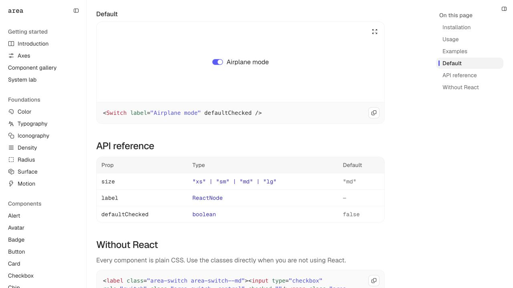
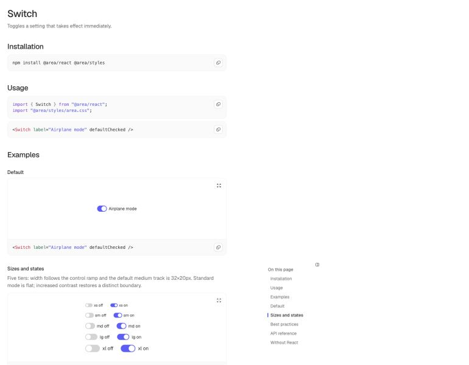
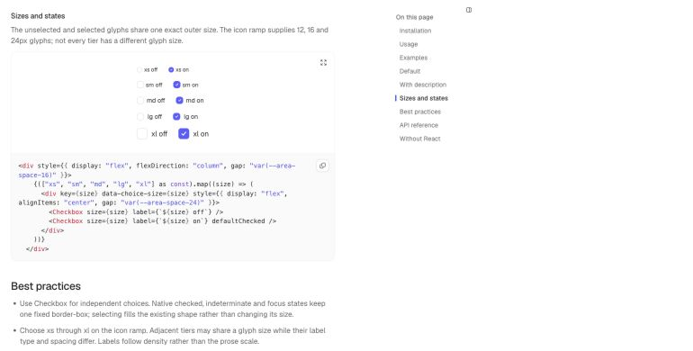
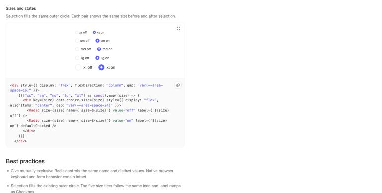
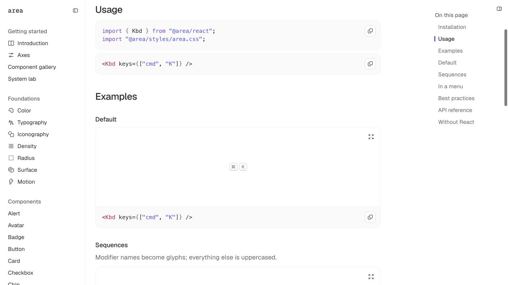
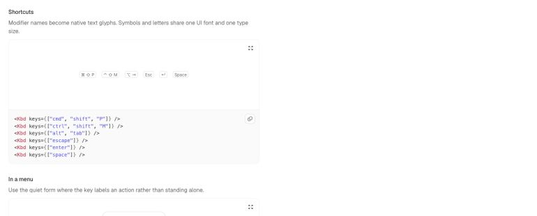
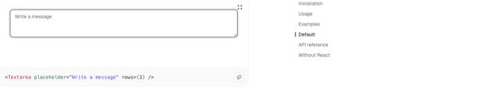
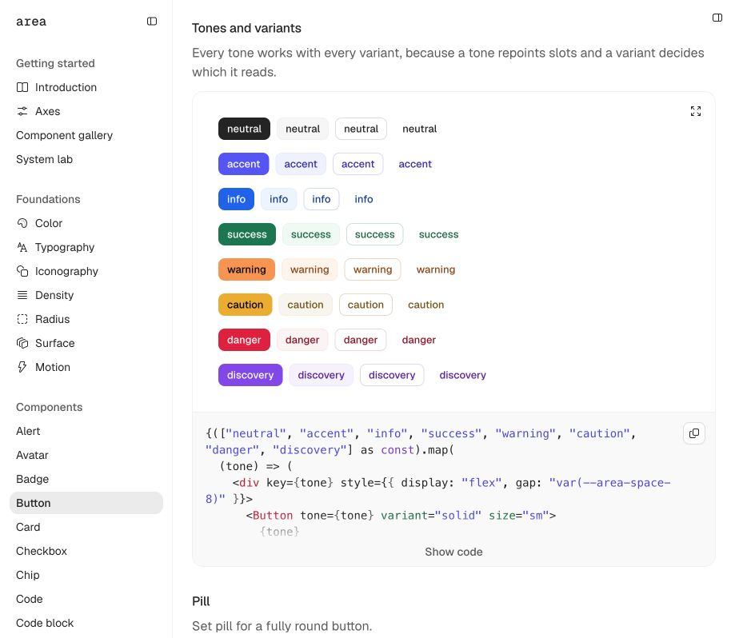
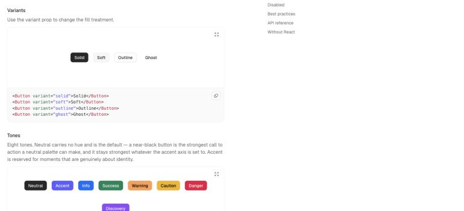

# V03 — native control polish

V03 responds to the control screenshots supplied on 2026-09-15. It keeps the existing
palette and the short V02 shadow geometry, then refines size, selected-state geometry,
keyboard hints, field focus and shadow visibility as one visual system.

## Before and after

### Switch

The former medium track was 28×16px and read as a miniature glyph. The new default is
32×20px with a 16px thumb and a flat, stroke-free standard boundary. Five documented tiers
now cover xs through xl.

| Before | After |
| --- | --- |
|  |  |

### Checkbox and Radio

Selected controls used a contrasting border that made the colored face look smaller. Every
control now uses `border-box`; in standard mode the selected edge matches its fill, while
increased contrast restores the strong state edge. Browser measurement confirmed identical
checked and unchecked outer dimensions at all five tiers: 12, 16, 16, 16 and 24px.

### Keyboard hint

The former treatment boxed every key separately and added an inset keycap shadow. The new
component follows [Primer KeybindingHint](https://primer.style/product/components/keybinding-hint/):
one flat chord container, normal and small sizes, a quiet menu treatment, and no shadow.
[Primer’s source](https://github.com/primer/react/blob/main/packages/react/src/KeybindingHint/components/Key.tsx)
renders condensed key names as text. Area therefore uses native Unicode/text legends in a
shared system UI font rather than Fluent icons; glyph and letter metrics come from one face.

| Before | After |
| --- | --- |
|  |  |

Normal chords are 20px high at 12px type; small chords are 16px high at 11px type. Command,
Shift, Option, Control, Tab, Escape, Enter, arrows and Space have named input mappings and a
spoken label for assistive technology.

### Editable field focus

Input, Textarea and Select now share one focus recipe. The resting 1px faint border remains
in place, an opaque 2px neutral edge sits directly outside it, and a 6px halo uses the shared
shadow ink. This is substantially quieter than the supplied gray references while retaining
an opaque focus perimeter. Increased contrast changes the neutral edge back to the accent
focus color. Forced colors continues to use the platform Highlight color.

Reference input and textarea screenshots are preserved in `references/`. The applied result:

### Shadows

V02’s contact shadow was visually disappearing around outline buttons. V03 raises only the
shared ink from 4% to 6% black in light themes and from 6% to 8% in dark themes. The contact
shadow remains `0 0.5px 1px -0.5px`; no tier gains extra offset, blur or spread.

| Before | After |
| --- | --- |
|  |  |

## Measured result

- Palette source SHA-256: `8035be3c95f72da6dc95ec407e6ca27be794cefdcf376b50dd9f9f0be5bed64c`.
- Color curves SHA-256: `d85f91e99275c1d66c3799a3cff91a04852c3ddd2c5462f6c7d81ac08f030e39`.
- Default Switch: 32×20px; thumb 16×16px; 2px inset.
- Checkbox/Radio: checked and unchecked outer boxes are identical at every tier.
- Kbd: 20px/12px normal and 16px/11px small; one outline; no box shadow.
- Field focus: 1px faint border, 2px opaque edge, 6px 6%/8% halo on every Surface preset.
- Button contact shadow: 6%/8% ink with unchanged tight geometry.
- Scope matrix: 75,493 passed / 0 failed.
- Preference inheritance: 288 passed / 0 failed.
- Painted matrix: standard 18,108 passed / 3,012 documented soft-edge shortfalls;
  increased contrast 21,120 passed / 0 failed.
- Token contrast report: 308 passing assertions / 0 failures across 66 themes.

The standard-mode shortfalls are boundaries and state indicators intentionally quieter than
the 3:1 test. They remain visible in the report and are not described as accessibility
conformance. Text and opaque focus checks pass; increased contrast passes the complete matrix.

## Verification

- `npm test`: 16,322 tests passed.
- `npm run build`: axis integrity, stylesheet build and 36-component manifest parity passed.
- `npm run build:docs`: 46 pages / 106 demos; dogfood audit passed.
- `npm run typecheck`: all workspaces passed.
- `npm run lint:manifest`: passed.
- `npm run test:contracts`: 12/12 passed.
- `npm run test:preview`: 4/4 passed with localhost socket permission.
- `npm run test:consumer`: 24 export targets plus strict declarations, SSR, browser bundling
  and tree-shaking passed.
- `node packages/tokens/src/contrast/report.ts`: 308/0.

E05 interaction architecture remains the next batch. These changes refine existing native
controls and presentation; they do not claim that composite behavior or platform release
validation is complete.
