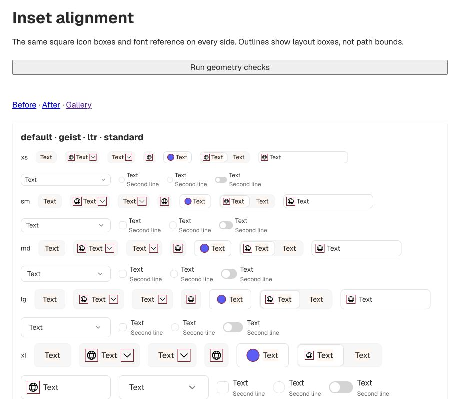
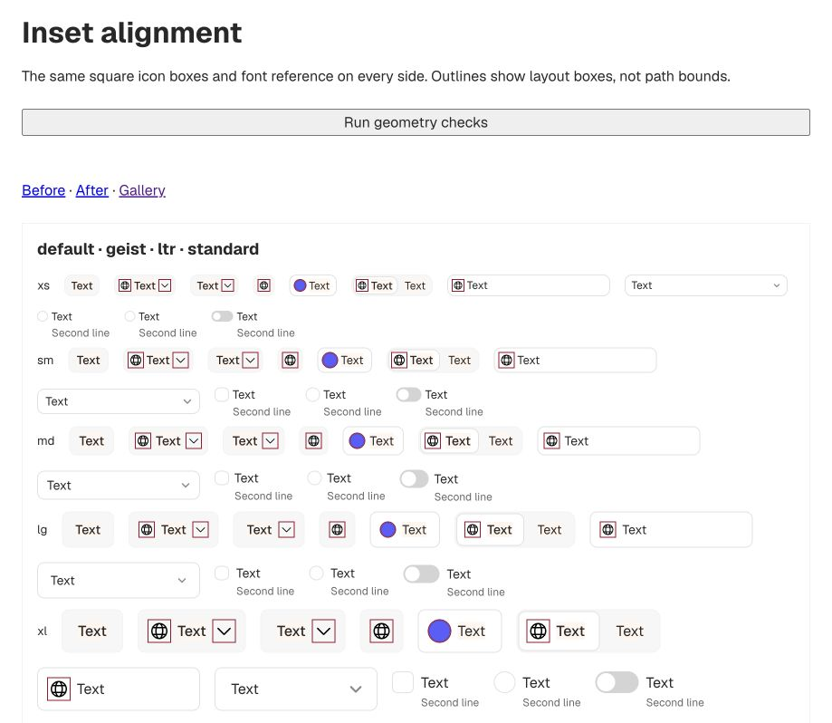
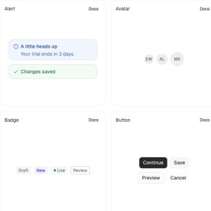

# V04 — optical insets and first-line alignment

The user's two references define the rule: use the complete square icon box, center
text by one font reference, and balance each edge item's inset against the backplate.
For multiline content, the icon stays at the top inset and centers on the first text
line. More space below the icon is intentional.

## Implementation

`packages/styles/src/inset.css` centralizes outer-edge spacing. An edge box B in a
backplate H gets `(H - B) / 2` outer clearance; CSS padding subtracts the border once.
Both ends follow the rule, including chevrons, swatches, nested shortcuts, badges and
panel actions. Icon paths and the palette are unchanged.

Text slots use one cap-to-baseline reference with symmetric safety padding for accents
and descenders. React and framework-free docs now supply the same label slots; the
manifest includes them. Multiline Alert/Toast and choice labels align to the first line.
The title/description boundary retains normal leading, avoiding compressed line spacing.

Chip and Segmented now use the same icon/text/gap tier as Button and Input. Select's
chevron gap follows its tier, too. Nav/Menu and Alert/Toast use medium UI text, icons and
gaps. There is no per-icon adjustment, cropping, path change or stroke-weight adjustment.
The exact pairs and exceptions are in [the design contract](../../DESIGN_SYSTEM.md#optical-insets).

The always-applied [rule](../../../.cursor/rules/optical-insets.mdc), AGENTS and maintenance
instructions preserve this behavior for future components.

## Before and after

The gallery before image was captured before source changes. The two inset specimens
use identical current React markup; the before specimen loads the frozen stylesheet
from `27096be`. This isolates the CSS difference, rather than presenting a mockup.

Full-gallery captures: [before](gallery-before.png), [after](gallery-after.png),
[390px after](gallery-mobile-after.png). Supplied references: [insets](reference-insets.png)
and [multiline](reference-multiline.png).

## Reproduction and verification

Run `npm run dev`, open `http://localhost:4321/inset.html`, and click **Run geometry checks**.
`inset-before.html` runs the same checks with the frozen stylesheet. The test compares
actual rectangles; it does not simply compare two copies of a padding formula.

The matrix covers both densities, all five tiers, all four font presets, LTR/RTL,
light/flat/standard and dark/outlined/increased-contrast profiles, plus round corners.
It checks icon and text edges, native chevron placement, nested backplates, first-line
alignment, and icon/text/gap parity between control families. Repeat at 390px.

Both desktop and 390px runs pass **5,728 checks with zero failures**. The frozen before
stylesheet fails 3,592 of the same checks. Results are recorded in [desktop](geometry-after.json), [mobile](geometry-mobile.json),
and [baseline summary](geometry-before.json). The baseline retains the first 24 failures
rather than thousands of repeated entries. The maximum passing rounding error is
0.0078125px; the tolerance is 0.15px. No document overflow at either viewport.

- `npm test`: 16,322 tests in 9 files pass.
- Contrast report: 308 passing groups, 0 failures, 0 active waivers, 66 themes.
- `npm run build:docs`: 48 pages, 106 demos, manifest parity and dogfood audit pass.
- `npm run typecheck`, `npm run lint:manifest`, `npm run test:contracts` (12 tests),
  and `npm run test:consumer` pass.

## Limits

The browser geometry checks were run in Chromium. Safari/Gecko/OS font validation is
still part of E10. The font reference is shared, not a promise of identical ink bounds
for every word or script. Native editable text retains browser-managed glyph metrics.
Browsers without text-box support retain line-box placement for fixed-height controls.
The [CSS text-box documentation](https://developer.mozilla.org/en-US/docs/Web/CSS/Reference/Properties/text-box)
explains the font-edge mechanism; it does not modify the glyph outlines.

Full-width rows deliberately contain spare interior space. Marker menus retain their
selection-rail lane. Multiline containers balance the content group rather than trying
to give every line equal clearance from all four sides. Existing accessibility behavior
work and documented standard-mode soft-edge shortfalls are unchanged.
